+++
title = "Architecture and Landscape of Shantou University"
date = 2024-11-14
updated = 2024-11-14
description = "This article, combining text and images, showcases the unique architectural beauty and cultural heritage of the Shantou University (STU) Sangpu Mountain Campus, and tells the stories and design concepts behind these buildings.  The article not only introduces the well-known “Most Beautiful Library in Asia”, but also delves into other iconic buildings and landscapes such as the school gate, the Truth Bell, the Sports Park, the “Big and Small People” sculpture, the Medical School building, the ACC, and the Graffiti Wall, showcasing the unique charm of the STU campus, a blend of East and West, old and new."

[taxonomies]
tags = ["Shantou University", "Architecture", "Campus", "Culture", "Library"]

[extra]
quick_navigation_buttons = true
toc = true
+++

STU, her beauty, leaves a deep impression.  Beauty is also the first reaction of many people when I mention STU. They ask me about the STU library, once known as the "Most Beautiful Library in Asia". But, the beauty of STU is more than just this.

Currently, the main campuses of STU are the "Sangpu Mountain Campus" and the "East Coast Campus".

The East Coast Campus opened in October 2022.  Its history is short, its cultural atmosphere is still developing, and it lacks widely known, intrinsic stories.

The Sangpu Mountain Campus is where STU was founded and launched.  Nestled in the "embrace" of Sangpu Mountain, it backs onto Riyue Lake and faces Daxue Road. This is the intersection of new and old, East and West.

For a short period of several years, STU also had a transitional campus, borrowing the facilities of Shantou City Health School.

This article will focus on the architecture and landscape of the Sangpu Mountain Campus and the stories behind them.

## STU School Gate

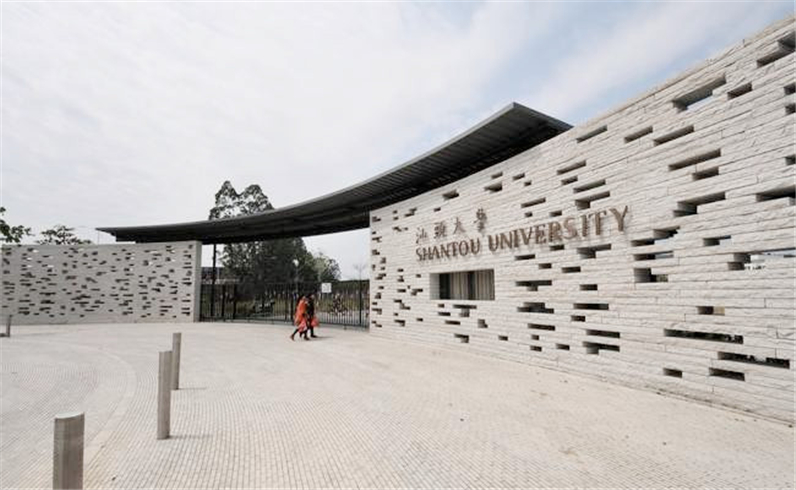

The simple grey school gate, with its arc-shaped stone wall, has both the simple freshness of the West and the dynamic elegance of the East. Small stone holes interspersed in the wall quietly emit light in the dark night.  From these holes, one can glimpse the scenery inside the campus from outside, creating a sense of openness and mystery.

## Truth Bell

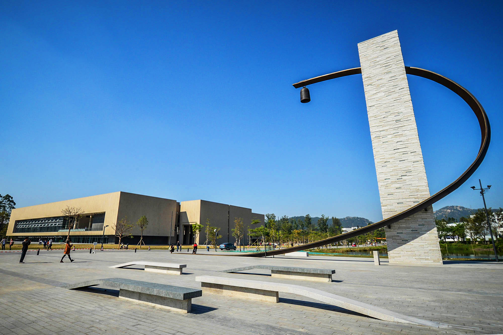

A simple metal arc suspends a Chinese-style bell and a stone tower, forming STU's Truth Bell.  The lyrical metal arc is inspired by the strokes of calligraphy, representing the convergence of two sides of the thinking process.  The specially embedded lighting in the stone tower points to modern technology and innovation.  When the bell rings, walking on the campus paths at dusk is like strolling through an ancient temple in the deep mountains. The distant bell echoes throughout the campus, inspiring every STU student in their pursuit of truth.

> The Master Behind It: Maya Lin
>
> 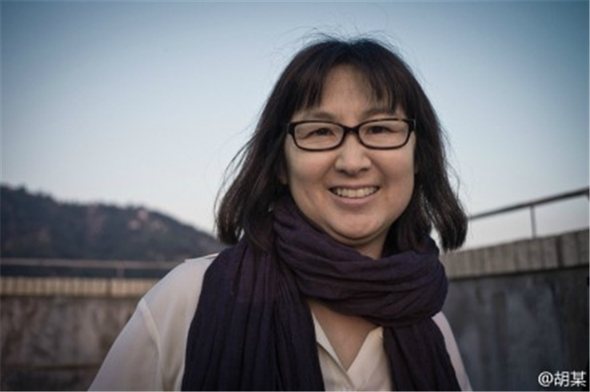
>
> The designer of STU's new school gate and the Truth Bell is the Chinese-American female architect Maya Lin, the niece of Lin Huiyin. She was named one of "The 100 Most Important Americans of the 20th Century" and "50 Future Leaders of America" by *Life* magazine.  Obama personally awarded her the National Medal of Arts. This is the highest honor given to artists by the U.S. government, and Maya Lin was the only woman among the recipients.

## Sports Park

The Sports Park has a novel appearance and rich connotations. The design concept is "Sky Park", a sports and leisure activity space that allows interaction between people and the landscape.  This design concept comes from the Italian poet Petrarch's literary work *The Ascent of Mount Ventoux*, where "the journey and experience of climbing the mountain are more valuable than overlooking from the top." The donor of this project, Mr. Li Ka-shing, also hopes to use this to inspire STU students: not only to be satisfied with short-term victories, but also to cherish and enjoy the experience of studying, living, entertaining, overcoming difficulties, and growing together.

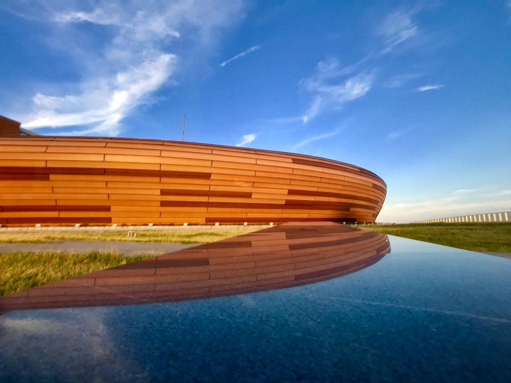

## Library

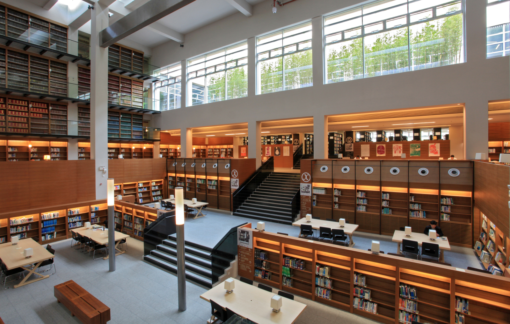

The library was designed by Chen Rui Xian, winner of the "Asia's Most Influential Design Award".  He was personally appointed by Mr. Li Ka-shing. Known as the "Poet of Architecture", his design works are spread throughout Hong Kong, Taiwan, and mainland China, including the famous Eslite Bookstore Kaohsiung Dayuanbai Store.

> The Master Behind It: Chen Rui Xian
>
> 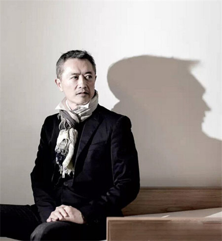
>
> The library was designed by Chen Rui Xian, winner of the "Asia's Most Influential Design Award".  He was personally appointed by Mr. Li Ka-shing. Known as the "Poet of Architecture", his design works are spread throughout Hong Kong, Taiwan, and mainland China, including the famous Eslite Bookstore Kaohsiung Dayuanbai Store.

## "Big and Small People"

In the pool outside the right wall of the Shantou University Library stands a 5-meter-high stainless steel sculpture by the renowned sculptor Zadok Ben David.  "Big and Small People" is its intuitive name, while the design name of this sculpture is "Looking Up, Looking Down", corresponding to "Building the Self, Pursuing Selflessness". The artist hopes to create a fantastic reality that is both reasonable and unexpected through the stacking of figures, the contrast in size, and the combination of rational thinking and intuition.  This sculpture aims to inspire STU students to establish their own outlook on life, values, and worldviews in the pursuit of knowledge and truth, and to transcend themselves and achieve the realm of "selflessness" on their continuous journey forward.

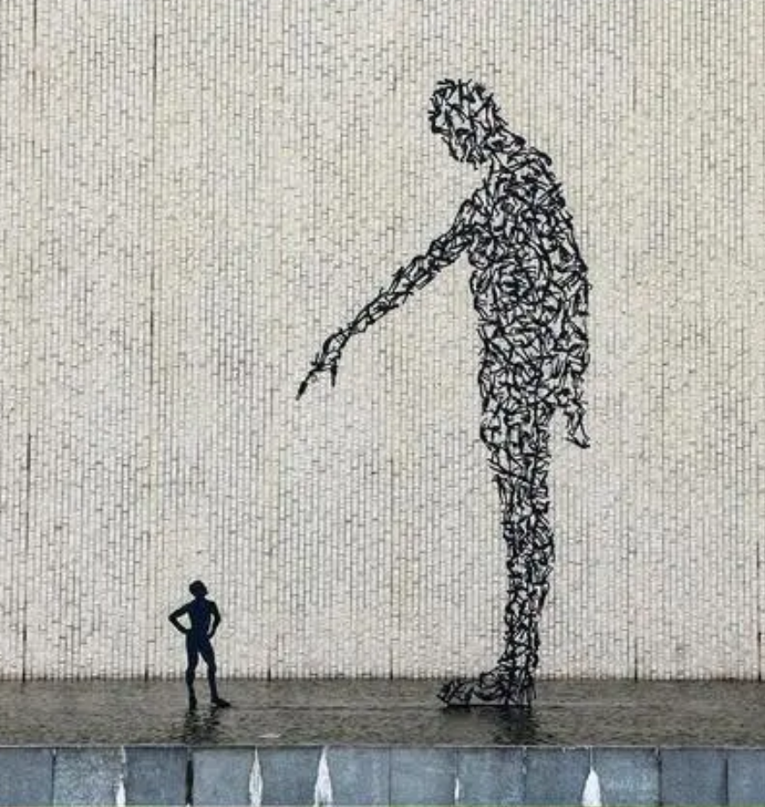

## Main Campus

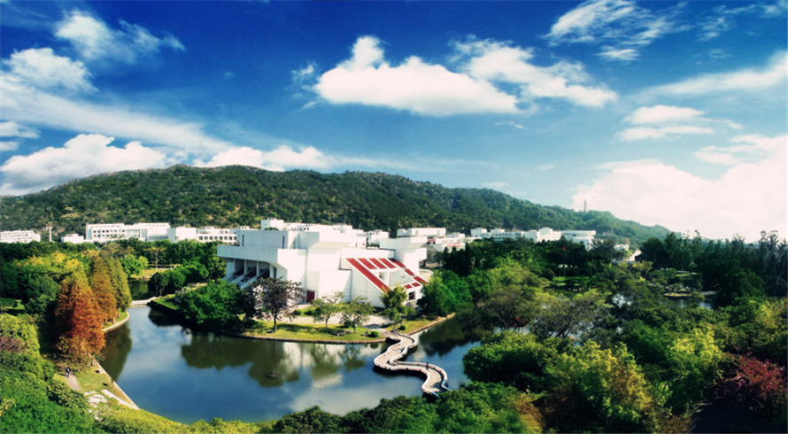

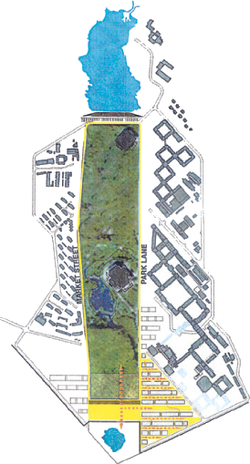

The STU campus is centered on a pedestrian street, with symmetrical buildings on both sides in a Western style.  Utilizing the two natural scenic spots of Sangpu Mountain at the back and the reservoir nearby, it combines humanities and nature to create a unique campus space.  The old campus buildings are arranged according to the pattern of the Taiji Bagua formation in Chinese Taoist classics. Walking through the crisscrossing paths, one can feel the charm of the changing architecture and the essence of traditional Chinese culture. The combination of new and old buildings on campus is like a twin flower, making people marvel at the artistic charm produced by the collision of these two cultures.

> The Masters Behind It: Herzog & de Meuron
>
> 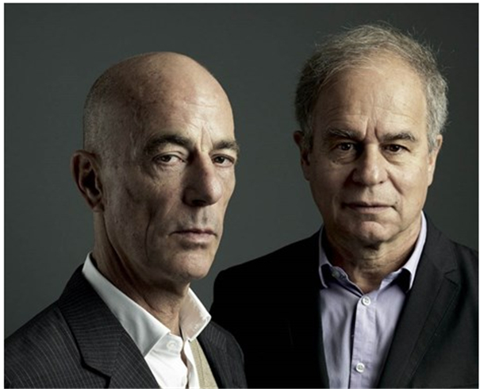
>
> A world-renowned architectural firm, the designers of the Beijing Olympic "Bird's Nest".  Jacques Herzog and Pierre de Meuron are among the most successful and influential architects of their time.  They have 180 employees in London, Beijing, Barcelona, San Francisco, Munich and other major cities around the world.  In 2001, they were honored with the Pritzker Prize, the most important architectural award from the Hyatt Foundation, for their transformation of a former London power station into the Tate Modern.

## Medical School Building

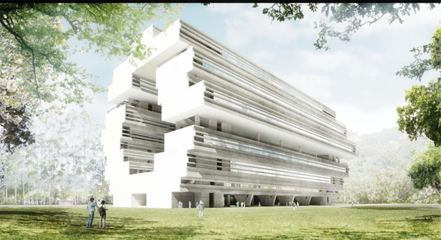

The new Medical School building, with Herzog & de Meuron Basel Ltd. as design consultants, embodies the following design concept: Located in a lush subtropical landscape, the main building of the new Medical School starts from a rational arrangement of functional rooms.  Each function is stacked vertically around a central space, forming an academic ring and evolving the building's unique character.

## ACC

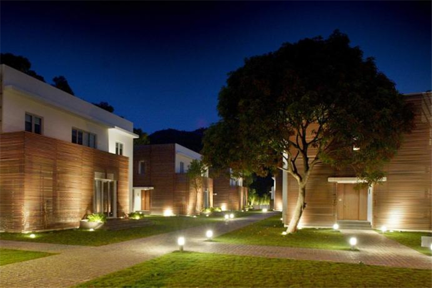

Designed by renowned designer William Chang, this international university exchange center has over fifty rooms.  The conference halls and guest rooms are equipped with modern facilities.  It has hosted many large-scale international conferences and received officials from international organizations, guests from all walks of life, and renowned scholars from home and abroad.

## Graffiti Wall

This graffiti is not that kind of graffiti.  On the back hill of STU, there is a long path along a wall, and this wall is our Graffiti Wall.  After lunch, or during an evening walk, along this path, you will see a variety of paintings in different styles, perhaps romantic, perhaps strange, perhaps childish, or perhaps profound.

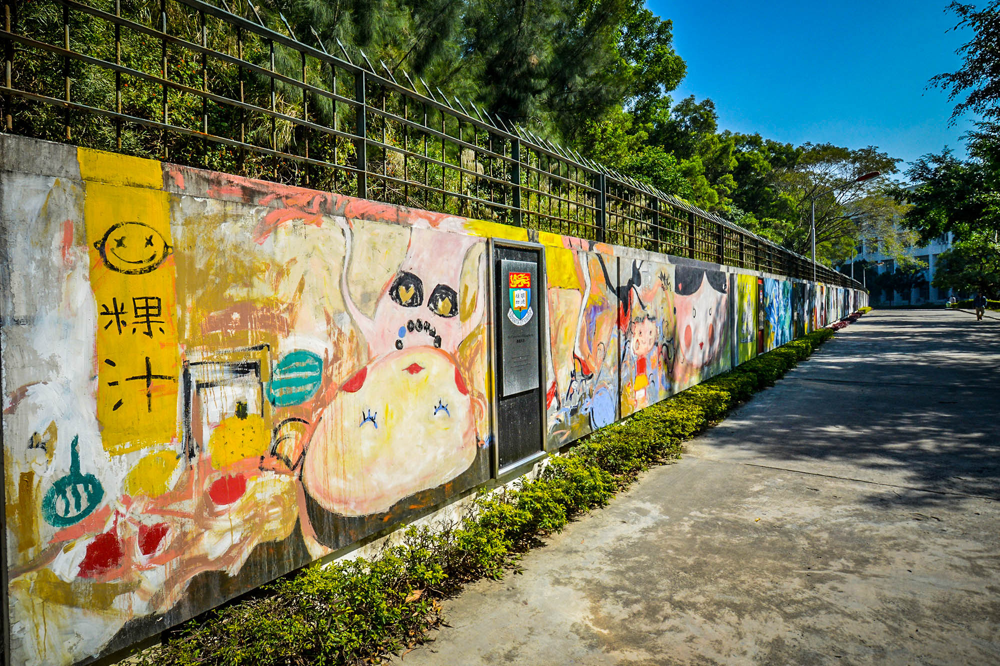

## Reservoir and the Twelve Copper Men

The STU Reservoir, also known as Riyue Lake, is located in the deepest part of STU.  Twelve copper men stand on the reservoir's management office.

At the entrance to the copper men, their creator, Mr. Ju Ming, inscribed a short poem: "Hell is on earth, heaven is on earth, where do you go, it depends on your thoughts." Mr. Ju Ming has a series of "Living World Series - xxx" sculptures, and the twelve copper men at STU are called "Living World Series - Gentlemen".  The twelve gentlemen are all dressed in suits, some holding umbrellas, some carrying briefcases, some pulling suitcases; they stand back to back.  The vicissitudes of life are fully displayed.

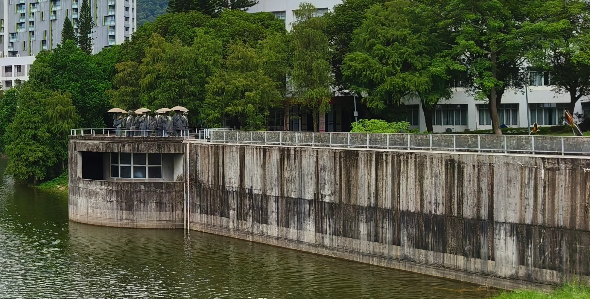

The Shantou University emblem resembles an open book.  The golden phoenix flower on the book represents Shantou (the golden phoenix flower is the city flower of Shantou), and the waves below indicate its coastal location. There is also a phoenix taking flight, symbolizing that this university in Shantou cultivates pillars of society.  The school motto is: Aspiration, Knowledge, Perseverance, Achievement. Zeng Guofan once said: "The first thing a scholar needs is aspiration, the second is knowledge, the third is perseverance.  With aspiration, one will never be content with mediocrity; with knowledge, one knows that learning is endless and dares not be complacent with a little achievement; with perseverance, there is nothing that cannot be achieved."  The Shantou University motto encourages students to have clear aspirations and strong will, to cultivate knowledge and wisdom, to persevere, and to be people of achievement.

---

References:

- <https://blog.sina.com.cn/s/blog_50fab7250102z9jr.html>
- <https://baike.baidu.com/item/%E6%B1%95%E5%A4%B4%E5%A4%A7%E5%AD%A6%E6%B6%82%E9%B8%A6%E5%A2%99/19463152>
- <https://blog.sina.com.cn/s/blog_7816961c0101c6fq.html>
- <https://zs.stu.edu.cn/info/1008/1133.htm>
