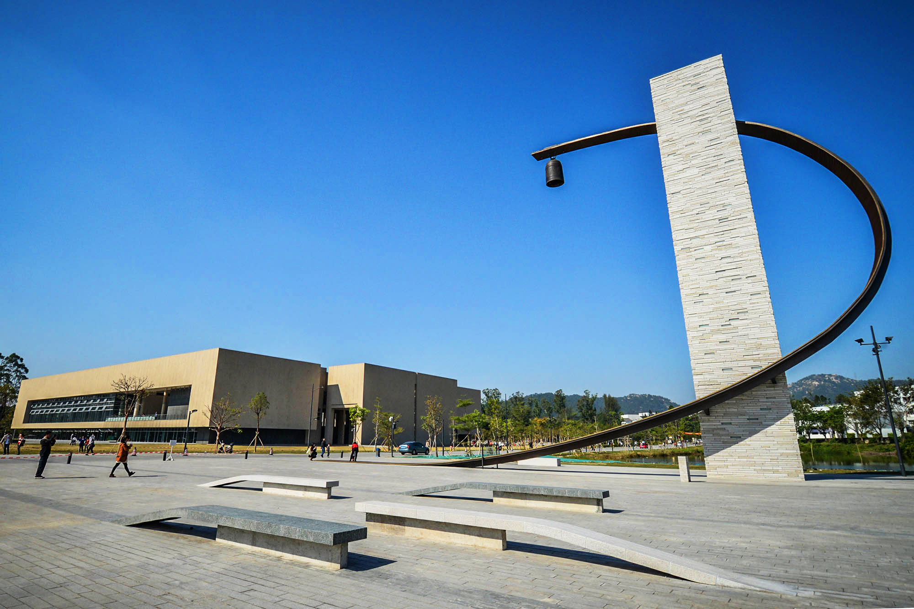
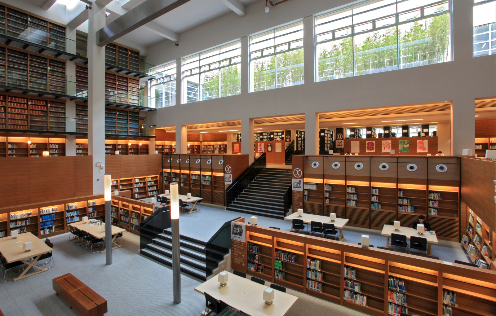
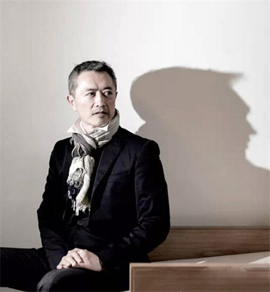
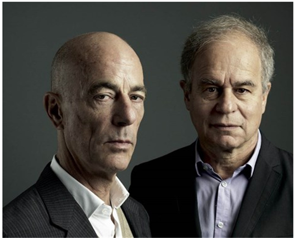
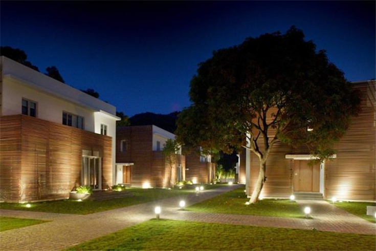

+++
title = "汕头大学的建筑及景观"
date = 2024-11-14
updated = 2024-11-14
description = "本文以图文结合的方式，展现了汕头大学桑浦山校区独特的建筑之美和人文底蕴，并讲述了这些建筑背后的故事和设计理念。文章不仅介绍了为人熟知的“亚洲最美图书馆”，更深入挖掘了校门、真理钟、体育园、“大小人”雕塑、医学院楼、ACC以及涂鸦墙等标志性建筑和景观，展现了汕大校园中西合璧、新旧交融的独特魅力。"

[taxonomies]
tags = ["汕头大学", "建筑", "校园", "人文", "图书馆"]

[extra]
quick_navigation_buttons = true
toc = true
+++

汕大，她的美，能给人留下更深刻的印象。美，也是我和许多人提起汕大后，他们的第一反应。他们会问我，那曾被称为“亚洲最美图书馆”的汕大图书馆。但，汕大的美，不仅于此。

目前，汕大主要的校区是“桑浦山校区”和“东海岸校区”。

东海岸校区启用于2022年10月，历史尚短，人文气息不足，广为人知的、内在的故事尚缺。

桑浦山校区，是汕大奠基和启航的地方，坐落在桑浦山的“怀抱”中，背靠日月湖，面朝大学路。这里是新和旧、中和西的交汇点。

在短短的几年时间里，汕大还有过一个过渡校区，借用的是汕头市卫生学校。

本文所要讲述的，是桑浦山校区的建筑和景观，及其背后的故事。

## 汕大校门

古朴灰色的校门，石板墙砌筑出的弧形，既有西方的简约清新，又带着东方的灵动飘逸。墙上交错杂出的小石洞，会在幽暗的夜晚静静地发出光芒。从中可以在门外一窥校园内的景色，开放中又蕴含着神秘气质。

## 真理钟

一道简单的金属弧吊着一个中国式的吊钟和一座石楼，构成了汕大的真理钟。抒情的金属弧形灵感来自书法的笔触，代表着思维过程的两面汇合。特别嵌入灯光的石楼，指向现代的科技与创新。钟声响起，行走在黄昏的校园小路上就如踱步于深山古寺。悠远的钟声回荡在这校园里，激励着每一个汕大人求索真理的脚步。

> 背后的大师：林璎
>
> 
>
> 汕大新校门和真理钟的设计者都是美籍华人女建筑师林璎(Maya Lin),她是林徽因的侄女。曾被美国《生活》杂志评为“二十世纪最重要的一百位美国人”和“五十位美国未来的领袖”。奥巴马曾亲自为她颁发美国国家艺术奖章。这是美国官方给予艺术家的最高荣誉，而林璎是此次获奖者中唯一的女性。

## 体育园

体育园外观新颖，内涵丰富，设计理念为“空中公园”，是一个能让人与景观互动的体育休闲活动空间。该设计理念来自意大利诗人彼特拉克的文学作品《登顶旺图山》中的“登山的旅程及经历比站在顶峰俯瞰更宝贵”。该项目捐建者李嘉诚先生也希望借此寄寓汕大学子：不要仅满足于短暂的胜利，更应懂得珍惜及享受一同学习、生活、娱乐、共渡难关、共同成长的经历。

## 图书馆

图书馆由“亚洲最具影响力设计大奖”获得者陈瑞宪设计，这是李嘉诚先生亲自指定的设计师。被称为“建筑诗人”的他，设计作品遍及港台及中国大陆，著名作还有诚品书店高雄大远百店。

> 背后的大师：陈瑞宪
>
> 
>
> 图书馆由“亚洲最具影响力设计大奖”获得者陈瑞宪设计，这是李嘉诚先生亲自指定的设计师。被称为“建筑诗人”的他，设计作品遍及港台及中国大陆，著名作还有诚品书店高雄大远百店。

## “大小人”

汕头大学图书馆右侧的外墙水池中，矗立着一座“大小人”雕塑，高5米，用不锈钢材料建造，是著名雕刻艺术家Zadok Ben David的作品。“大小人”是直觉上的名字，而这座雕塑的设计名称是“looing up, looking down”，对应着“建立自我，追求无我”。作者希望通过人像的堆砌和尺寸的对比，加上理性思考与直觉，创造出一种情理之内、意料之外的奇幻现实。该雕塑旨在激励汕大学子在追求知识真理的过程中建立自我的人生观、价值观与世界观，并且在不断前行的路上超越自我，达到“无我”的境界。

## 主体校园

汕大校园整体以步行街为中轴线,两边对称的建筑倍具西式风格。利用背靠桑浦山和紧临水库的两处天然胜景,将人文与自然结合,创造出独特校园空间。老校园的建筑群是按照中国道教经典的太极八卦阵的格局排列的，走在每一条小路的纵横交错中，感受建筑中变化的魅力和中国传统文化的韵味。校园后期的新建筑和老建筑的中西结合如同一朵双生花，让人惊叹在这两种文化的碰撞中竟会产生如此之艺术魅力。

> 背后的大师: Herzog and De Meuron
>
> 
>
> 世界著名建筑公司，北京奥运“鸟巢”的设计者。JACQUESHERZOG AND PIERREDEMEURON排名于同时代最成功和最有影响力的建筑师之中。他们有180位雇员分布于伦敦、北京、巴塞罗那、旧金山、慕尼黑和其它一些世界主要城市中。在2001年，因为他们将一个旧的伦敦发电站改建为TATEMODERN艺术馆，而荣幸地获得了HYATTFOUNDATION颁发的最重要建筑奖——PRITZKER奖。

## 医学院楼

新医学院楼，由来自德国的设计公司Herzog & de Meuron Basel Ltd.(赫尔佐格和德默隆巴尔有限公司)担任设计顾问，其设计理念为：新医学院主楼坐落在茂盛的亚热带景观环境中，从理性排列功能用房出发，各功能竖向环绕着一个中央空间堆叠，形成学术环，衍化出建筑独有的个性。

## ACC

著名设计师张叔平设计的国际级大学交流中心，房间数目逾五十间。楼内会议厅及客房均配备现代化的设备，曾举办过多次大型国际会议，接待过国际组织官员、各界嘉宾和国内外著名学者等。

## 涂鸦墙

此涂鸦非彼涂鸦。在汕大的后山，有那么一条长长的靠墙小路，而这面墙，就是我们的涂鸦墙。午饭过后，傍晚步行，沿着这条路走下去，你会看到一幅幅风格迥异的图画，可能是浪漫的，可能是诡异的，可能是幼稚的，也可能是深沉的。

## 水库及十二铜人

汕大水库，也被称做日月湖，坐落在汕大最深的位置。水库的管理室上，立着十二个铜人。

在铜人入口处，它们的创造者，朱铭先生题了一首小诗：“地狱在人间，人间有天堂，问君何处去，但凭一念间。” 朱铭先生有一系列的《人间系列-xxx》雕塑，汕大的十二铜人叫《人间系列-绅士》。十二个绅士，都穿着西装，有的打着伞、有的提着公文包、有的拉着行李箱；相背而站。人间百态炎凉，毕现其中。

汕头大学校徽像一本打开的书，书上的金凤花代表汕头（金凤花是汕头市花），下面的海浪说明地处海滨；还有一只展翅腾飞的凤凰，是寓意这所位于汕头的大学培养出社会栋梁之才。校训  有志、有识、有恒、有为。曾国藩曾说："士人第一要有志，第二要有识，第三要有恒，有志则断不甘为下流，有识则知学问无尽，不敢以一得自足，有恒则断无不成之事"。汕头大学校训训勉广大学子，要有明确的志向和坚强的意志，历练知识和智慧，持之以恒，做有为之人。

---

参考：

- <https://blog.sina.com.cn/s/blog_50fab7250102z9jr.html>
- <https://baike.baidu.com/item/%E6%B1%95%E5%A4%B4%E5%A4%A7%E5%AD%A6%E6%B6%82%E9%B8%A6%E5%A2%99/19463152>
- <https://blog.sina.com.cn/s/blog_7816961c0101c6fq.html>
- <https://zs.stu.edu.cn/info/1008/1133.htm>
