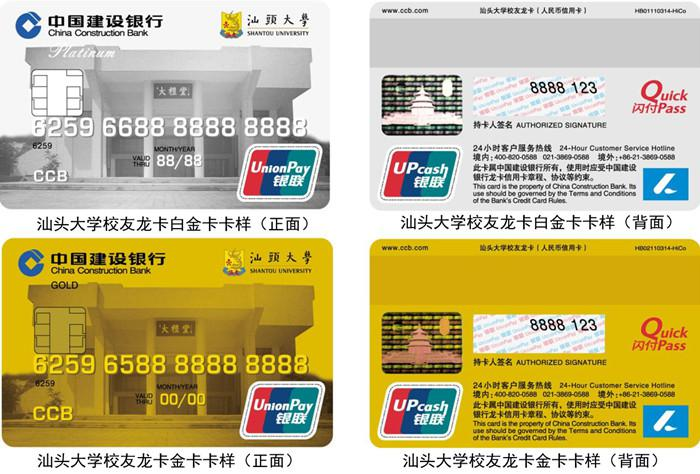
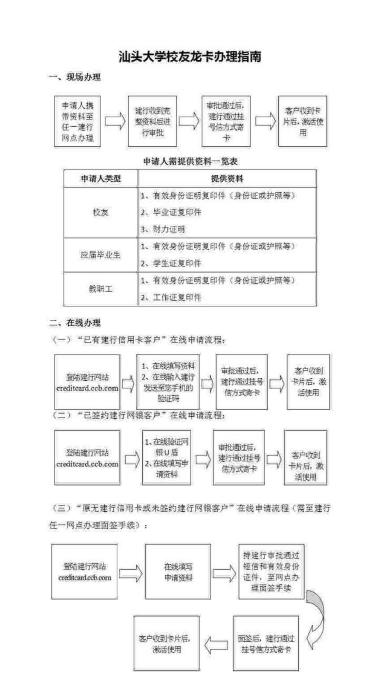

+++
title = "How to Apply for the Alumni Dragon Card"
date = 2024-08-26
updated = 2024-08-26
description = "The Shantou University Alumni Dragon Card is a credit card jointly issued by the Shantou University Alumni Association and China Construction Bank."

[taxonomies]
tags = ["alumni", "card"]

[extra]
quick_navigation_buttons = true
toc = true
social_media_card = "res/social.png"
+++

## 1. Definition

The Alumni Dragon Card is a commemorative credit card jointly issued by the Shantou University Alumni Association and China Construction Bank.

## 2. Benefits

- All financial functions of a credit card
- Library access
- 0.1% of consumption will be donated to the Alumni Scholarship Fund
- Various convenient services provided by the alma mater to alumni (to be verified)
- Optional fixed amount donation to the Alumni Scholarship Fund

## 3. Fees

- 20 yuan/year (`China Construction Bank will directly deduct 20 yuan/year from your Alumni Dragon Card account and inject it into the alma mater's Alumni Scholarship Fund according to your authorization`)

## 4. Application Process

### 4.1 In-Person Application

1. The applicant brings the required documents to any CCB branch for processing.
2. CCB reviews the complete set of documents after receiving them.
3. After the application is approved, CCB will mail the card via registered mail.
4. After receiving the card, the customer activates and uses it.

| Applicant Type | Required Documents                                                                      |
| ------------- | ----------------------------------------------------------------------------- |
| Alumni        | 1. Copy of valid identification (ID card or passport, etc.) 2. Copy of diploma 3. Proof of financial ability |
| Graduating Students | 1. Copy of valid identification (ID card or passport, etc.) 2. Copy of student ID card    |
| Faculty & Staff    | 1. Copy of valid identification (ID card or passport, etc.) 2. Copy of employee ID card    |

List of Required Documents for Applicants

### 4.2 Online Application

#### (1) Online Application Process for "Existing CCB Credit Card Customers":
1. Log in to the CCB website [creditcard.ccb.com](https://creditcard.ccb.com)
2. Fill in the information online
3. Enter the bank card transaction password and mobile phone verification code online
4. After the application is approved, CCB will mail the card via registered mail.
5. The customer activates and uses the card after receiving it.

#### (2) Online Application Process for "Customers Who Have Signed Up for CCB Online Banking":
1. Log in to the CCB website [creditcard.ccb.com](https://creditcard.ccb.com)
2. Verify with CCB U-Shield
3. Fill in the application information online
4. After the application is approved, CCB will mail the card via registered mail.
5. The customer activates and uses the card after receiving it.

#### (3) Online Application Process for "Customers Who Do Not Have a CCB Credit Card or Have Not Signed Up for CCB Online Banking" (Requires In-Person Verification at Any CCB Branch):
1. Log in to the CCB website [creditcard.ccb.com](https://creditcard.ccb.com)
2. Fill in the application information online
3. Go to a branch for in-person verification with the CCB approval SMS and valid ID.
4. After the in-person verification, CCB will mail the card via registered mail.
5. The customer activates and uses the card after receiving it.

> Image and reference:
> 
> - https://xyh.stu.edu.cn/alumni/front/account/detail.jsp?id=12761
>
> - https://info.stu.edu.cn/info/1364/2010.htm
