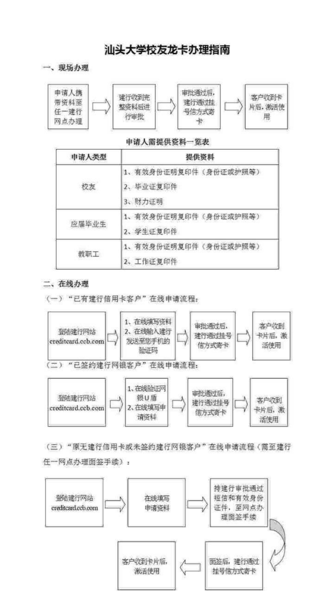

+++
title = "如何申办校友龙卡"
date = 2024-08-26
updated = 2024-08-26
description = "汕大校友龙卡是由汕头大学校友会和中国建设银行联合发行的信用卡。"

[taxonomies]
tags = ["alumni", "card"]

[extra]
quick_navigation_buttons = true
toc = true
social_media_card = "res/social.png"
+++

## 1. 定义

校友龙卡是一种具有纪念意义的信用卡，由汕大校友会和建行联合发行。

## 2. 权益

- 信用卡的所有金融功能
- 图书馆访问权限
- 校友助学基金将获得消费额的1‰
- 母校为校友提供的各项便利服务（待验证）
- 可自愿选择定额捐助校友助学基金

## 3. 资费

- 20元/年 （`建行将根据您的授权直接从您的校友龙卡账户扣划（20元/年）注入到母校校友助学基金`）

## 4. 办理

### 4.1 现场办理

1. 申请人携带资料至任一建行网点办理
2. 建行收到整套资料后进行审批
3. 审批通过后，建行通过挂号信方式寄卡
4. 客户收到卡片后，激活使用

| 申请人类型 | 提供资料                                                                       |
| ---------- | ------------------------------------------------------------------------------ |
| 校友       | 1. 有效身份证明复印件（身份证或护照等） 2. 毕业证复印件 3.  经济能力证明 |
| 应届毕业生 | 1. 有效身份证明复印件（身份证或护照等） 2. 学生证复印件                     |
| 教职工     | 1. 有效身份证明复印件（身份证或护照等） 2. 工作证复印件                     |

申请人需提供资料一览表

### 4.2 在线办理

#### （一）“已有建行信用卡客户”在线申请流程：
1. 登陆建行网站 [creditcard.ccb.com](https://creditcard.ccb.com)
2. 在线填写资料
3. 在线输入银行卡交易密码和手机的验证码
4. 审核通过后，建行通过挂号信方式寄卡
5. 客户收到卡片后，激活使用

#### （二）“已签约建行网银客户”在线申请流程：
1. 登陆建行网站 [creditcard.ccb.com](https://creditcard.ccb.com)
2. 验证网银U盾
3. 在线填写申请资料
4. 审核通过后，建行通过挂号信方式寄卡
5. 客户收到卡片后，激活使用

#### （三）“原无建行信用卡或未签约建行网银客户”在线申请流程（需至建行任一网点办理面签手续）：
1. 登陆建行网站 [creditcard.ccb.com](https://creditcard.ccb.com)
2. 在线填写申请资料
3. 持建行审批通过短信和有效身份证件，至网点办理面签手续
4. 面签后，建行通过挂号信方式寄卡
5. 客户收到卡片后，激活使用

> 图片及参考:
> 
> - https://xyh.stu.edu.cn/alumni/front/account/detail.jsp?id=12761
>
> - https://info.stu.edu.cn/info/1364/2010.htm
