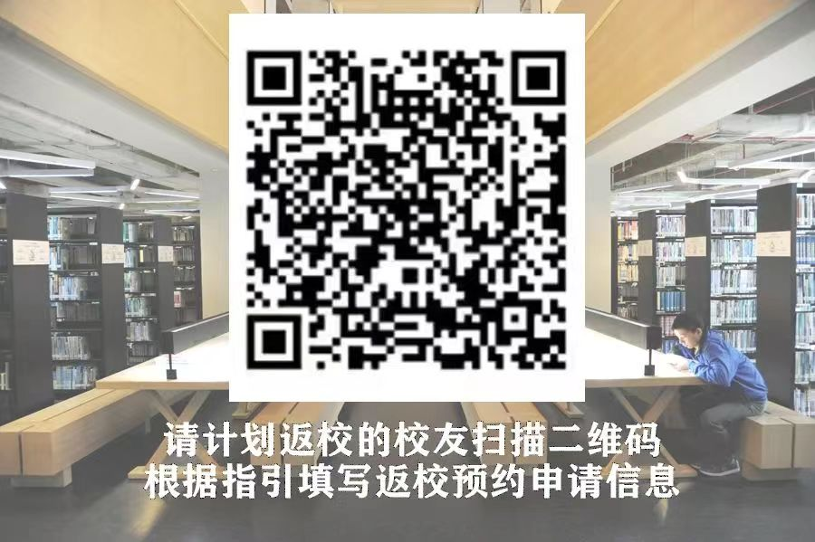

+++
title = "Alumni Returning to Campus"
date = 2024-08-26
updated = 2024-08-26
description = "How alumni can apply to return to campus"

[taxonomies]
tags = ["alumni"]

[extra]
quick_navigation_buttons = true
toc = true
+++

The following instructions are quoted from the "Shantou University Alumni Association" WeChat official account:

>
> Dear Alumni,
>
> Please fill in the application information for entering the campus one day in advance with your accompanying relatives and friends (the number of people entering the campus on the same day is recommended to be within 10). The relevant guidance information is as follows:
>
> ### I. Instructions for Filling in the Application Information for Returning to Campus
> 1. Receptionist: Chen Shida
> 2. Receptionist's Email: chensd@stu.edu.cn
> (Note: The receptionist information is only used for application approval. If you fill in the information of other teachers on campus, please ask the staff responsible for the entry system management in the department where the teacher is located to handle it.)
> 3. Campus Selection: Please select according to the actual situation (Note: The application record will be synchronized to the visitor systems of the two campuses, and alumni can go to the Sangpu Mountain Campus or the East Coast Campus according to their itinerary.)
> 4. Reason for Visitor's Entry: Please fill in your grade, major, and name (e.g., 14 Journalism Chen xx)
> 5. License Plate Number: Please fill in the license plate information accurately. After the application is approved, the access control system will automatically enter and identify the license plate information.
> 6. According to the school's requirements, every person entering the campus needs to submit an application for entry, and the guard will check the scan code. Accompanying relatives and friends should also fill in and submit information through the "Alumni Channel". Please note that in the "Reason for Entry", please remark: 14 Journalism Chen xx's family/friend;
> 7. The east gate of Sangpu Mountain Campus has added a visitor verification QR code, which can be used to scan the QR code with WeChat at the duty room window to verify your identity before entering and exiting the campus.
>
>
> ### II. Obtaining the Login Link for Returning to Campus Application
> You can click the small keyboard icon in the lower left corner, enter "Alumni Returning to Campus" in the input box, and click send to get the QR code for the application entrance. Scan the QR code to enter the application system, select "Alumni Visitor Channel", and fill in and submit the return to campus reservation application according to the instructions.
>
> 
>
> The application result can be viewed by refreshing the application page. If there is no timely reply, please contact Mr. Chen by SMS at 13192173317.
>
>

