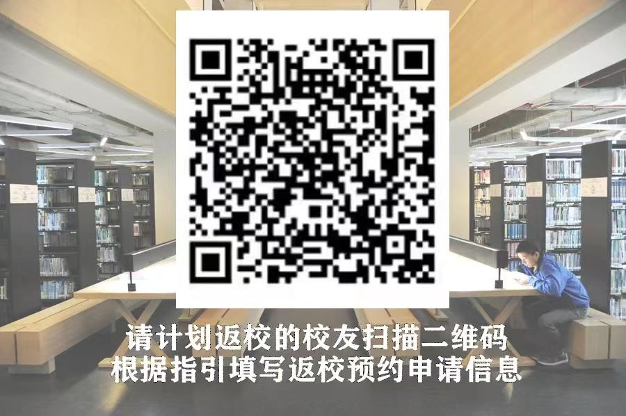

+++
title = "校友返校"
date = 2024-08-26
updated = 2024-08-26
description = "校友如何「申请」返校"

[taxonomies]
tags = ["alumni"]

[extra]
quick_navigation_buttons = true
toc = true
+++

在「汕头大学校友会」微信公众号有这般指引，引用如下：

> 
> 亲爱的校友，您好！
> 
> 请您与同行的亲友（当天入校人数建议10人以内）提前一天填写入校申请信息，相关指引信息如下：
> 
> ### 一、返校申请信息填写指引
> 
> 1.接待人：陈仕达
> 
> 2.接待人邮箱：chensd@stu.edu.cn
> 
> （注：接待人信息仅供申请审批使用，如填写校内其他老师信息，需请该老师所在部处负责入校系统管理的工作人员处理）
> 
> 3.校区选择：请根据实际情况选择（注：申请记录会同步到两个校区访客系统，校友可根据行程安排前往桑浦山校区或东海岸校区）
> 
> 4.访客入校理由：请填写您的年级、专业、姓名（如：14新闻陈xx）
> 
> 5.车牌号：请准确填写车牌信息，申请通过后门禁系统会自动录入、识别车牌信息。
> 
> 6.根据学校要求，每位入校人员都需要提交入校申请，门卫会检查扫码情况。同行亲友也请通过“校友渠道”填写提交信息，注意要在“入校事由”处备注：14新闻陈xx家属/朋友；
> 
> 7.桑浦山校区东门已增加配置访客验证二维码，可在值班室窗口使用微信扫二维码验证身份后进出校园。
> 
> 
> ### 二、返校申请登录链接获取
> 
> 您可以点击左下角小键盘图标，在输入框内输入“校友返校”，点击发送即可获得申请入口二维码，扫描二维码进入申请系统，选择“校友访客渠道”，根据指引填写并提交返校预约申请。
>
> 
> 
> 申请结果可通过重新刷新申请页面查看，如未及时回复，请短信联系陈老师，联系电话：13192173317。
>
> 