+++
title = "[Repost] STU Memory丨Beyond 'A Letter to Grandma', a Century-Spanning 'Education Love Letter'"
date = 2026-05-22
updated = 2026-05-22
author = "Shantou University"
description = "Liu Houwu and his descendants' three-generation spiritual接力 with Shantou University — from abandoning his post in 1947 to found Chaozhou University, to Liu Zunyi becoming an honorary professor at STU in 1994, a century-spanning education love letter."

[taxonomies]
tags = ["repost", "Shantou University", "history", "Liu Houwu", "Qiaopi"]

[extra]
quick_navigation_buttons = true
toc = true
+++

> Reposted from Shantou University WeChat official account: [STU Memory丨Beyond "A Letter to Grandma", a Century-Spanning "Education Love Letter"](https://mp.weixin.qq.com/s/xmyfgfO_Px7-VIR_98DhAA)
>
> This is a repost. If there is any infringement, it will be removed immediately.

---

In the movie *A Letter to Grandma*,

the Qiaopi (overseas Chinese letter) written by Xu Yuqian from Thailand to his homeland

moved countless audiences with the deep patriotism of overseas Chaoshan people

spanning mountains and seas.

Yet few noticed

that within the lines of this "school-building love letter"

lies an educational obsession spanning nearly a century —

the unrealized dream of a Chaoshan sage who spent half his life campaigning for a university,

ultimately continued by his descendants

on this land at the foot of Sangpu Mountain

in a different, quiet way.

This is the "second love letter," more moving than the screen story.

This is the three-generation spiritual relay of Liu Houwu, his son, and grandson,

written to the Chaoshan land

and to Chinese education,

spanning time and space.

---

## A Qiaopi Hides a Half-Century Unfulfilled Dream

In this Qiaopi treasured by the Shantou City Archives (see image below), Xu Yuqian could barely contain his excitement upon learning that Shantou University had been approved for establishment: "After the peace, Liu Houwu came to Thailand and campaigned for the establishment of Chaoshan University, but it was stillborn. Today's establishment is truly the fortune of our Chaoshan people." These few words capture the regret and hope of a generation of Chaoshan people.

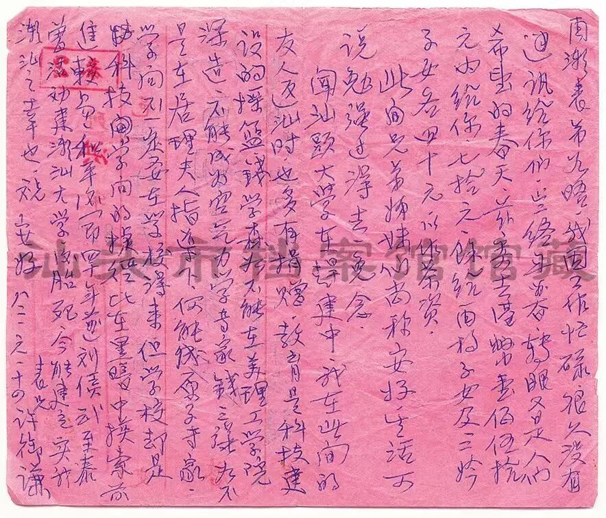

Liu Houwu, mentioned in this Qiaopi, was a native of Guliao, Chaoyang, Guangdong. In his early years, he joined Sun Yat-sen's Tongmenghui and participated in the Guangzhou Huanghuagang Uprising. He later served as a Supervisory Committee member of the National Government's Control Yuan and as the Supervisor of Guangdong and Guangxi. Despite his high position, he always cared deeply about education in his hometown. After the victory of the War of Resistance Against Japan, witnessing the plight of young people in the Chaoshan region with no access to education, he resolutely resigned from his post as Supervisor of Guangdong and Guangxi in November 1947, dedicating himself fully to the筹备 of Chaozhou University and personally serving as the chairman of the preparatory committee. For this university, he traveled across the Chaoshan region, Hong Kong, and Thailand, fundraising from overseas Chinese. Countless overseas Chaoshan people were moved by his sincerity and generously donated. However, due to turbulent times and war, the Chaozhou University, which was on the verge of establishment, was ultimately "stillborn," becoming the greatest regret of Liu Houwu's life.

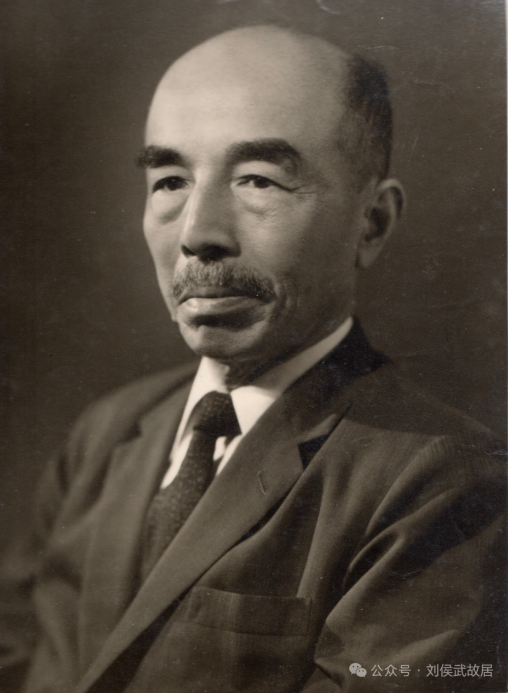

Afterward, he moved to Hong Kong and then traveled to Thailand and Singapore, continuing to投身 overseas Chinese education and参与 the筹备 of Nanyang University, but again failed to see it through. In 1975, Liu Houwu passed away in Hong Kong, still念念不忘 higher education in his hometown even on his deathbed. He perhaps never imagined that the Chaoshan university he failed to see with his own eyes would, half a century later, truly stand at the foot of Sangpu Mountain and along the East Coast.

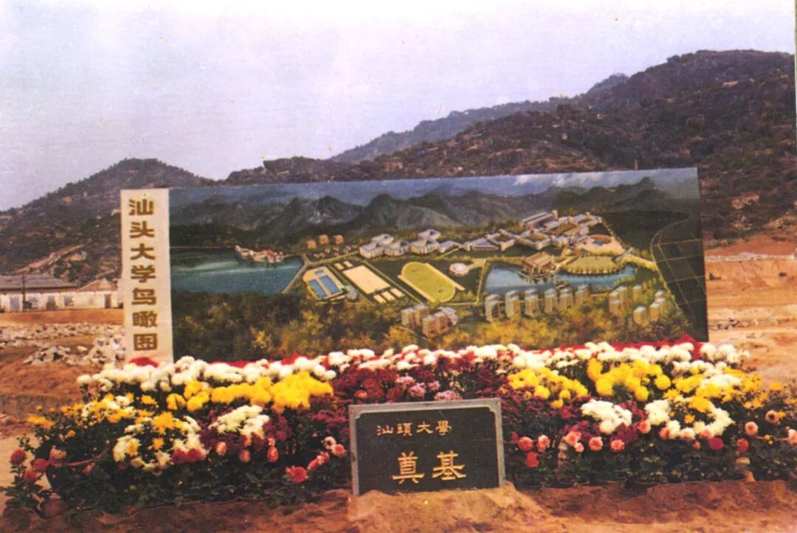

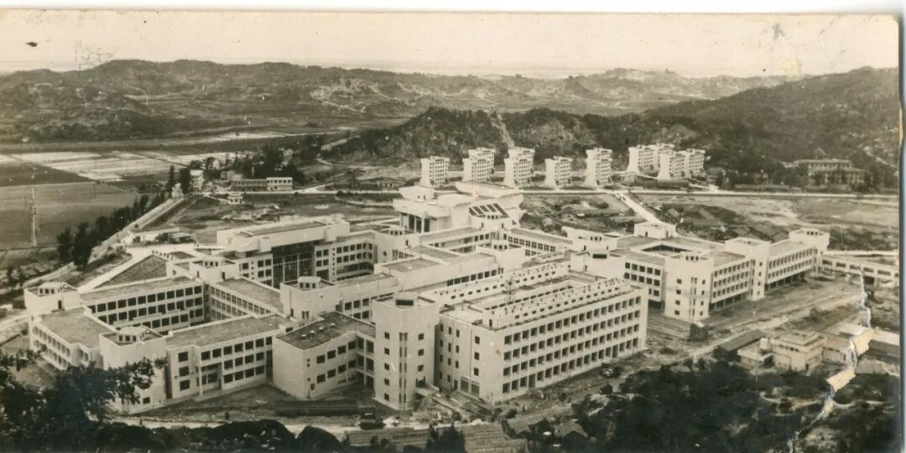

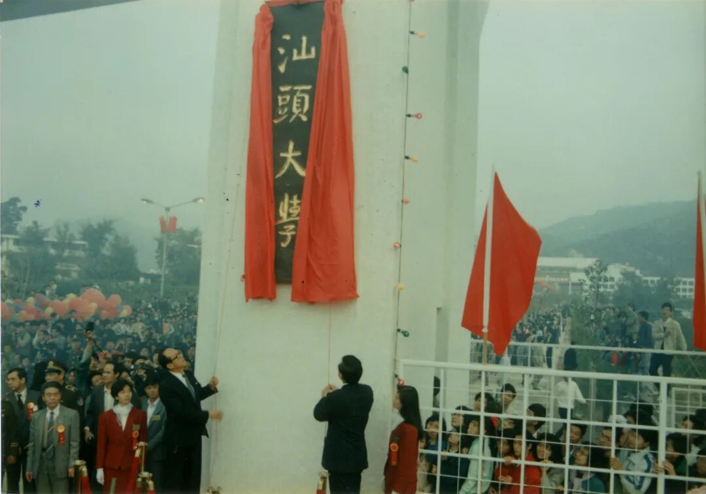

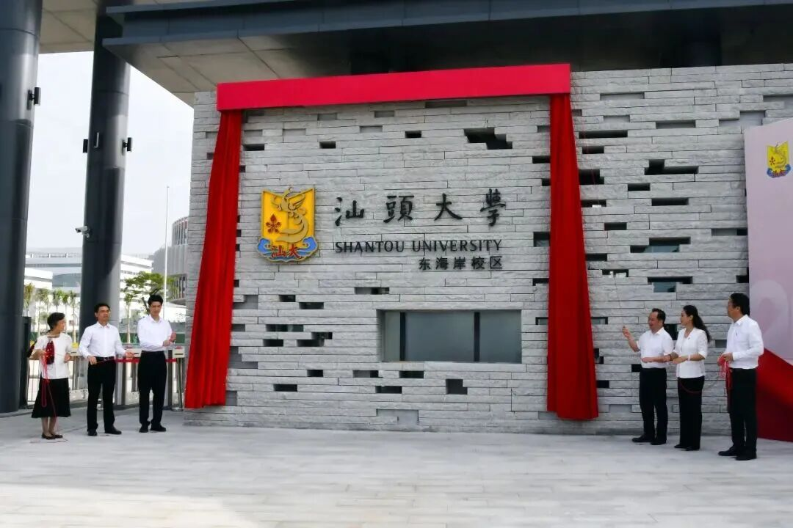

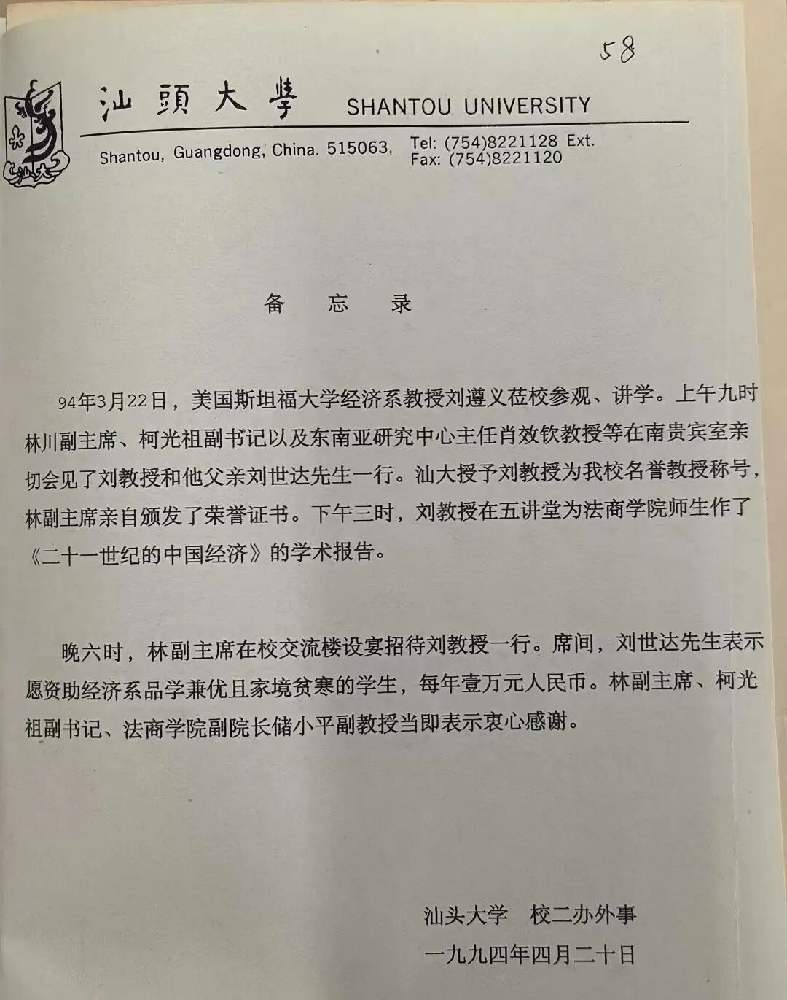

## Passing the Torch: Descendants Continue Grandpa's Education Love Letter

On March 22, 1994, in the Southern VIP Room of Shantou University, a simple yet dignified appointment ceremony was held. Lin Chuan, Vice Chairman of the University Board, personally presented the honorary professorship certificate to Professor Liu Zunyi, a renowned economist from Stanford University. This scholar, then Director of the Stanford University Asia-Pacific Research Center, was none other than Liu Houwu's grandson.

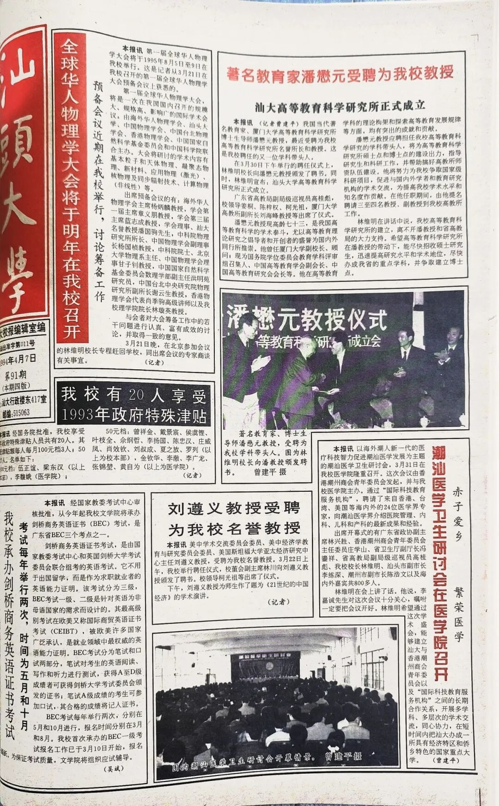

During this visit, Liu Zunyi not only delivered a brilliant academic report titled "China's Economy in the 21st Century," opening a window to the world for faculty and students of the School of Law and Business, but also brought the concerns of two generations of the Liu family for Chaoshan education. At the dinner, his father, Mr. Liu Shida, immediately offered to donate 10,000 RMB annually to support outstanding yet financially disadvantaged students in the Economics department.

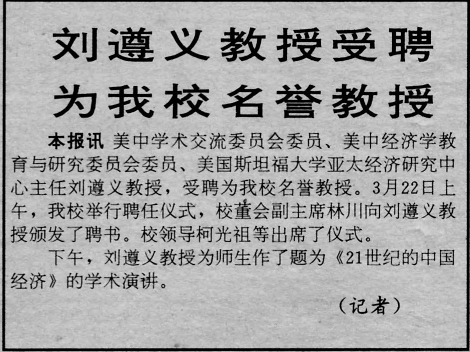

This intention later materialized as the "Liu Houwu Scholarship." Named after his grandfather, this scholarship was awarded for many years at the Shantou University School of Business, with its stated purpose being especially sincere: "Reward excellence, spur progress, establish a fine academic atmosphere, and cultivate economic talents." Each full scholarship was 1,000 RMB, and each单项 scholarship was 500 RMB. Every grant embodied the sincere dedication of three generations of the Liu family to education in their hometown, carrying their ardent hopes for the growth and success of local students. It also allowed Liu Houwu's unrealized educational dream to take root quietly at the foot of Sangpu Mountain.

Over the following years, Liu Zunyi始终 concerned himself with STU's development. He frequently visited the campus to give lectures and engage in academic exchanges, bringing cutting-edge international economic concepts to STU classrooms, and leveraging his academic influence to facilitate STU's disciplinary development and international exchanges.

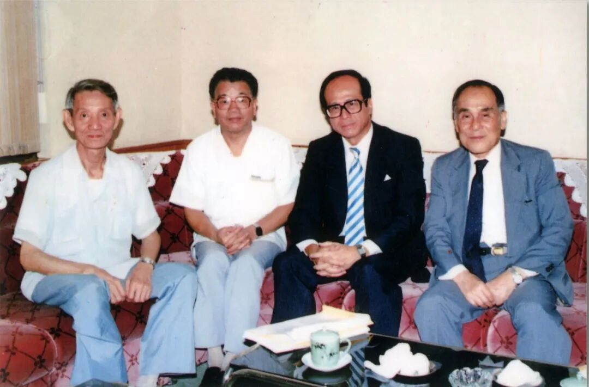

A yellowed 1994 manuscript of *Shantou University News* captured the moment of that appointment ceremony; pages of scholarship evaluation regulations bear witness to this跨代际 deep affection for one's hometown.

## A Century-Spanning Relay: This is STU's Most Touching Underlying Tone

From Liu Houwu resigning his post to筹办 Chaozhou University in 1947, to Liu Zunyi becoming an honorary professor at STU in 1994; from Xu Yuqian's words in the Qiaopi — "truly the fortune of our Chaoshan people" — to STU's complete collection of 40,000 Qiaopi archives and 80,000 digital resources today; from the educational obsession of the older generation of sages to the cultural heritage of the new era of STU people. Nearly a century has passed. What has changed is the times; what has remained unchanged is the determination to promote education and cultivate talent, etched into the bones of the Chaoshan people.

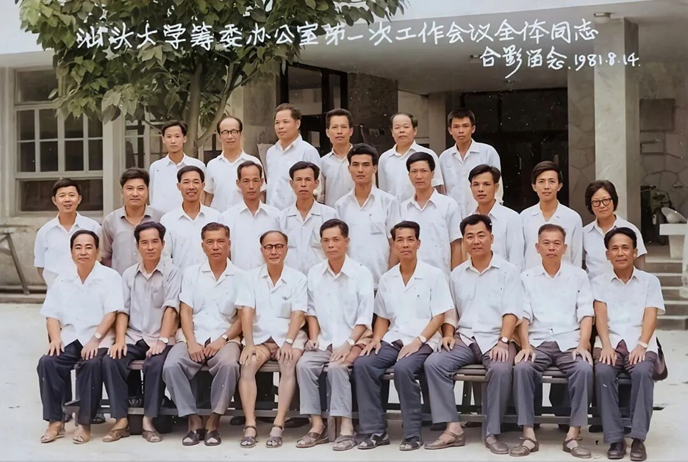

The birth of Shantou University was never the effort of a single individual, but rather a collective endeavor spanning mountains, seas, and generations. Here we find the painstaking planning and cultivation of older-generation proletarian revolutionaries like Wu Nansheng, Lin Chuan, and Xu Dixin, who laid the red foundation for this university with the responsibility of revolutionaries and the sentiment of educators. And there are countless overseas Chaoshan sages like Liu Houwu, Xu Yuqian, Zhuang Shiping, and Li Ka-shing, whose perseverance and dedication have been passed down through generations — some resigning from office to campaign for education, some donating generously without expecting anything in return, some dying with regret without witnessing the dream's fulfillment, and some carrying on the legacy to write new chapters. These impassioned words scattered in Qiaopi, these moving stories尘封 in archives, together forge the spiritual底色 of STU: "patriotism, love for hometown, reform, and innovation," becoming the university's most precious spiritual wealth.

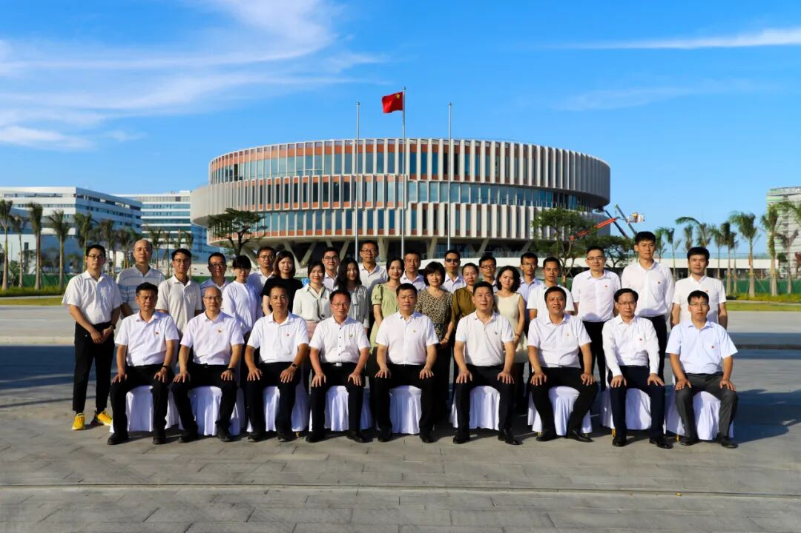

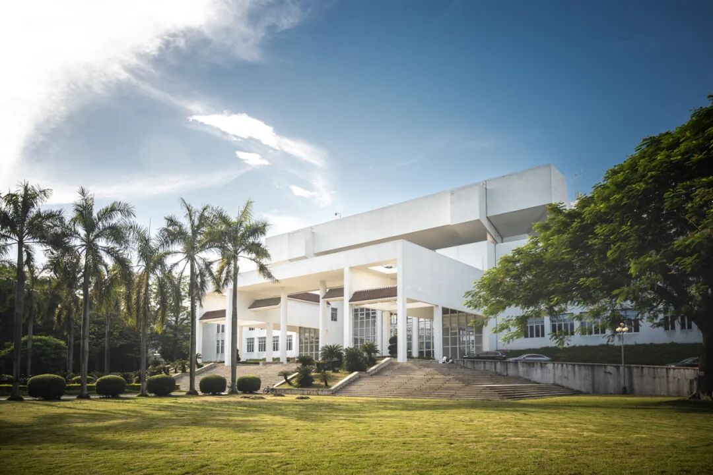

Today, Shantou University is依托 platforms such as the Chaoshan Cultural Preservation and Activation Laboratory, Regional and Country Studies Platform, and the Chaoshan Culture Research Center to deeply explore the history and emotions behind Qiaopi. Those letters that once carried longing and hope have now become important historical materials for studying Chaoshan overseas Chinese culture; the unrealized dreams of the older generation of sages have become the driving force for STU people to forge ahead.

---

The Qiaopi in the film is a love letter to Grandma.

Liu Houwu's efforts are a love letter to his homeland.

Liu Zunyi's inheritance is a love letter to his grandfather.

And the perseverance and struggle of generation after generation of STU people

are the best love letter written to this era.

One love letter, a century-long relay.

The sound of reading at the foot of Sangpu Mountain and along the East Coast

is the best consolation to all the sages.

---

Sources: Shantou City Archives' "Collection of Qiaopi: The Establishment of Shantou University is Truly the Fortune of Our Chaoshan People," written materials from Teacher Guo Gongxing of the School of Business

Text and Editing: Li Qiantong

Cover: Zhang Jiaman

Acknowledgments: Teacher Zeng Jianping, Teacher Wang Xiaodan of the Archives, and Teacher Bu Qiankun of the East Coast Campus Management Committee also contributed to this article

Review: Ye Nannan

Final Review: Du Shimin, Guo Gongxing
