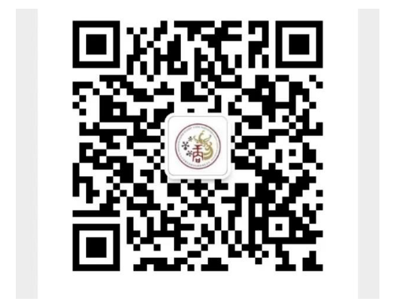

+++
title = "STU Alumni Association Contacts"
weight = 1
date = 2024-08-23
updated = 2024-10-01
description = ""

[taxonomies]
tags = ["alumni", "contacts"]

[extra]
quick_navigation_buttons = true
toc = true
+++

> PS:  Updates to this page require your help. If you find any missing or incorrect information, please submit an issue on GitHub or send an email to the [ST.U Maintainer](mailto:dev@ShanTou.University).

## 1. STU Shantou Alumni Association

- **Contact**: 2011 MBA, Shen Yiqing
- **Secretariat Phone**: 19820281505
- **Secretariat Email**: <ststuxyh@163.com>
- **Secretariat WeChat**: ststuxyh
  - When adding the alumni WeChat, please include your name, major, and year. The alumni will invite you to the group.

## 2. STU Guangzhou Alumni Association

- **Contact**: 01 Mechanical and Electrical, Guo Nengfei
- **WeChat ID**: guonengfei
  - When adding the alumni WeChat, please include your name, major, and year. The alumni will invite you to the group.

## 3. STU Foshan Alumni Association

- **Contact**: 96 Computer Science, Liang Zhibin
- **WeChat ID**: 13318228234
  - When adding the alumni WeChat, please include your name, major, and year. The alumni will invite you to the group.

## 4. STU Maoming Alumni Association

- **Contact**: 93 Fine Arts, Zhong Hongyi
- **WeChat ID**: zhy13709628808
  - When adding the alumni WeChat, please include your name, major, and year. The alumni will invite you to the group.

## 5. STU Chaozhou Alumni Association

- **Contact**: 06 Physics, Zeng Mengxu
- **WeChat Business Card**: When adding the alumni WeChat, please include your name, major, and year. The alumni will invite you to the group.

## 6. STU Shanghai Alumni Association

- **Contact**: 08 Architecture, Deng Congguang
- **WeChat ID**: YJA-13524335720
  - When adding the alumni WeChat, please include your name, major, and year. The alumni will invite you to the group.

## 7. STU Beijing Alumni Association (Updated 06/06)

- **Contact**: 08 Accounting (Graduate), Li Hengli
- **WeChat ID**: helen110023
  - When adding the alumni WeChat, please include your name, major, and year. The alumni will invite you to the group.

## 8. STU Fujian Alumni Preparatory Committee (Updated 06/06)

- **Contact**: 98 Public Administration, Yan Shengming
- **WeChat ID**: sun21boy
  - When adding the alumni WeChat, please include your name, major, and year. The alumni will invite you to the group.

## 9. STU Yunfu Alumni Association

- **Contact**: 10 Electronic Information Engineering, Zhang Shiwen
- **WeChat ID**: simonmvp0824
  - When adding the alumni WeChat, please include your name, major, and year. The alumni will invite you to the group.

## 10. STU Jieyang Alumni Preparatory Committee

- **Contact**: 11 Law, Zhang Chunbin
- **Phone/WeChat**: 15975146567
  - When adding the alumni WeChat, please include your name, major, and year. The alumni will invite you to the group.

## 11. STU Zhuhai Alumni Association

- **Contact**: 17 Electronic and Communication Engineering (Graduate), Bian Xinchao
- **Phone/WeChat**: 18666100997
  - When adding the alumni WeChat, please include your name, major, and year. The alumni will invite you to the group.

## 12. STU Zhanjiang Alumni Association

- **Contact**: 94 Mechanical and Electrical, Fu Sunyun
- **WeChat ID**: wxid_6k1icqowflw222
  - When adding the alumni WeChat, please include your name, major, and year. The alumni will invite you to the group.

## 13. STU Chenghai Alumni Association

- **Contact**: 04 Clinical Medicine (Bachelor's and Master's), Lin Xinpeng
- **Phone/WeChat**: 13790854303
  - When adding the alumni WeChat, please include your name, major, and year. The alumni will invite you to the group.

## 14. STU Macau Alumni Association (Updated 06/06)

- **Contact**: 99 E-Commerce, Liang Yingqi
- **WeChat ID**: keiiengsk2
  - When adding the alumni WeChat, please include your name, major, and year. The alumni will invite you to the group.

## 15. STU Zhaoqing Alumni Association

- **Contact**: 03 Biology, Li Jian
- **WeChat ID**: ljkenken
  - When adding the alumni WeChat, please include your name, major, and year. The alumni will invite you to the group.

## 16. STU Huizhou Alumni Association (Updated 06/06)

- **Contact**: 99 Art, Zhou Ai
- **WeChat ID**: aijoe_zhou
  - When adding the alumni WeChat, please include your name, major, and year. The alumni will invite you to the group.

## 17. STU Shaoguan Alumni Association (Updated 06/06)

- **Contact**: 84 Fine Arts, Qiu Xiaohua
- **Phone/WeChat**: 13509863078
  - When adding the alumni WeChat, please include your name, major, and year. The alumni will invite you to the group.

## 18. STU Heyuan Alumni Association

- **Contact**: 07 Environmental Art Design, Huang Bin
- **WeChat ID**: bhuang00
  - When adding the alumni WeChat, please include your name, major, and year. The alumni will invite you to the group.

## 19. STU Meizhou Alumni Association

- **Contact**: 95 English, Wei Zhiyu
- **WeChat ID**: gdmzwzy
  - When adding the alumni WeChat, please include your name, major, and year. The alumni will invite you to the group.

## 20. STU Dongguan Alumni Association

- **Contact**: Yuan Dun, 04 Business Administration
- **WeChat ID**: Newton_11
  - When adding the alumni WeChat, please include your name, major, and year. The alumni will invite you to the group.

## 21. STU Zhongshan Alumni Association

- **Contact**: 03 English, Xuan Hengkun
- **WeChat ID**: danielxuan1024
  - When adding the alumni WeChat, please include your name, major, and year. The alumni will invite you to the group.

## 22. STU Jiangmen Alumni Association (Updated 06/06)

- **Contact**: 01 Clinical Medicine, Huang Shuqing
- **WeChat Business Card**: When adding the alumni WeChat, please include your name, major, and year. The alumni will invite you to the group.

## 23. STU North American Alumni Association

- **Contact**: 88 Physics, Zhang Linlin
- **WeChat ID**: coolgirlno1
  - When adding the alumni WeChat, please include your name, major, and year. The alumni will invite you to the group.

## 24. STU Shanwei Alumni Association

- **Contact**: 93 Mechanical and Electrical, Yu Zukai
- **WeChat ID**: GDhenuo
  - When adding the alumni WeChat, please include your name, major, and year. The alumni will invite you to the group.

## 25. STU Qingyuan Alumni Association

- **Contact**: 99 Chinese, Liang Chunguang
- **WeChat ID**: 261876134
  - When adding the alumni WeChat, please include your name, major, and year. The alumni will invite you to the group.

## 26. STU Shenzhen Medical Alumni Association

- **Contact**: 84 Medical, Qiu Yonglong
- **WeChat ID**: A13603097127
  - When adding the alumni WeChat, please include your name, major, and year. The alumni will invite you to the group.

## 27. STU Hong Kong Alumni Association (Updated 06/06)

- **Contact**: 05 Journalism, Chen Xiafei
- **WeChat ID**: audreychan9
  - When adding the alumni WeChat, please include your name, major, and year. The alumni will invite you to the group.

## 28. STU Yangjiang Alumni Association (Updated 06/06)

- **Contact**: 91 Design, Huang Chuangshang
- **WeChat ID**: 13929924927
  - When adding the alumni WeChat, please include your name, major, and year. The alumni will invite you to the group.

## 29. STU Graduate Program Alumni Association (Updated 06/06)

- **Contact**: Secretariat
- **WeChat Business Card**: When adding the alumni WeChat, please include your name, major, and year. The alumni will invite you to the group.

## 30. STU MBA Alumni Association (Updated 06/06)

- **Contact**: 18 MBA, Li Jin
- **WeChat ID**: Jinn922
  - When adding the alumni WeChat, please include your name, major, and year. The alumni will invite you to the group.

## 31. STU Business Alumni Association

- **Contact**: Secretariat, Meng Qinglin
- **WeChat ID**: Szstucc, ss900413
  - When adding WeChat, please include your name, major, and year. The Secretariat will invite you to the group.

## 32. STU Yangtze School of Art and Design, Yangtze Aesthetic Society

- **Contact**: 04 Public Art, Zhong Mei
- **WeChat ID**: 13923814121
  - When adding the alumni WeChat, please include your name, major, and year. The alumni will invite you to the group.

## 33. STU School of Art, Shantou Alumni Association (Updated 06/06)

- **Contact**: 88 Industrial Design, Yang Qiang (Yang Kaijie)
- **WeChat ID**: jiayuzhen88
  - When adding the alumni WeChat, please include your name, major, and year. The alumni will invite you to the group.
